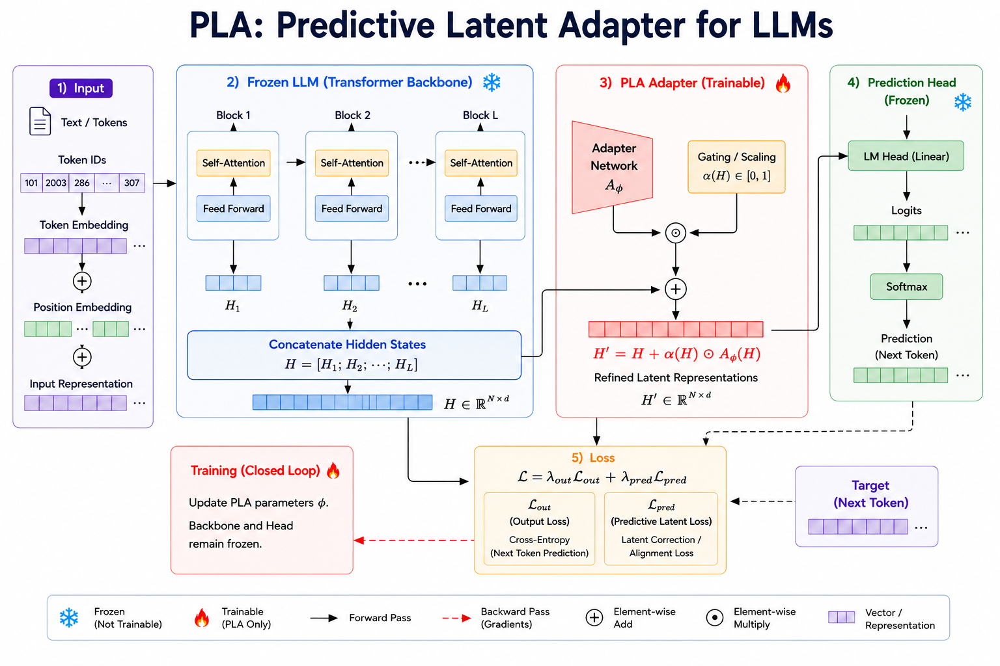

# PLA_LLM: Predictive Latent Adapter for Large Language Models

**Predictive Latent Adapter (PLA)** is a lightweight plug-and-play framework for adapting **frozen Large Language Models (LLMs)** through **latent representation refinement**.

Instead of updating the billions of parameters of a pretrained transformer during fine-tuning, PLA keeps the transformer backbone and prediction head completely frozen and learns only a compact latent refinement module. By drastically reducing the number of trainable parameters, PLA aims to lower computational cost, GPU memory requirements, and energy consumption while maintaining competitive downstream performance.

---

# Model Overview

  

PLA introduces a lightweight trainable adapter between the frozen transformer backbone and the prediction head.

The complete pipeline consists of five stages:

1. **Input Processing** – Input tokens are embedded and processed by a frozen transformer backbone.
2. **Hidden Representation Construction** – Hidden representations from all transformer layers are concatenated to construct a unified latent representation.
3. **Predictive Latent Adapter (PLA)** – A lightweight adapter predicts a latent correction together with an adaptive scaling factor.
4. **Prediction** – The refined latent representation is passed to the frozen prediction head.
5. **Training** – During optimization, gradients update only the PLA parameters while both the transformer backbone and prediction head remain frozen.

---

# Motivation

Modern Large Language Models often contain **billions of trainable parameters**, making conventional fine-tuning computationally expensive and energy intensive.

Parameter-Efficient Fine-Tuning (PEFT) methods reduce this cost by introducing additional trainable modules. PLA explores an alternative adaptation strategy by learning **how the latent representations themselves should be refined**, rather than modifying the internal transformer layers.

The central hypothesis behind PLA is that effective model adaptation can be achieved by optimizing a lightweight latent refinement module instead of repeatedly updating the entire backbone.

---

# Mathematical Formulation

Given an input sequence $x$, the frozen transformer backbone produces hidden representations

$$
H = [H_1; H_2; \cdots ; H_L],
$$

where $H_i$ denotes the hidden representation extracted from the $i$-th transformer layer.

The PLA adapter predicts a latent correction

$$
\Delta H = A_{\phi}(H),
$$

where $A_{\phi}$ denotes the trainable adapter network.

A lightweight gating function predicts an input-dependent scaling coefficient

$$
\alpha(H)\in[0,1].
$$

The refined latent representation is computed as

$$
H' = H + \alpha(H)\odot\Delta H.
$$

Finally,

$$
\hat{y}=D(H'),
$$

where $D(\cdot)$ denotes the frozen prediction head.

Only the parameters of the PLA module are optimized during training.

---

# Training Objective

PLA is trained by jointly minimizing the downstream prediction loss and the predictive latent refinement loss.

$$
\mathcal{L}
=
\lambda_{\text{out}}\mathcal{L}_{\text{out}}
+
\lambda_{\text{pred}}\mathcal{L}_{\text{pred}}
$$

where

- $\mathcal{L}_{\text{out}}$ denotes the downstream task loss.
- $\mathcal{L}_{\text{pred}}$ encourages meaningful latent refinements.

---

# Why PLA?

Unlike conventional parameter-efficient fine-tuning methods that introduce trainable weights inside transformer layers, PLA performs adaptation directly in the latent representation space.

This design offers several attractive properties:

- Lightweight plug-and-play architecture
- Frozen transformer backbone
- Frozen prediction head
- Latent representation refinement
- Parameter-efficient adaptation
- End-to-end optimization
- Compatible with existing pretrained LLMs

Most importantly, **PLA optimizes only a small trainable adapter instead of the entire transformer backbone**, substantially reducing the number of trainable parameters.

The expected benefits include:

- Reduced training cost
- Lower GPU memory consumption
- Lower energy consumption
- Faster optimization
- Easy integration into existing pretrained models

---

# Initial Experimental Plan

The first public implementation of PLA will be evaluated using **TinyLlama** as a lightweight proof-of-concept.

The initial benchmark will compare

| Method | Model |
|---------|-------|
| Full Fine-Tuning | TinyLlama |
| LoRA | TinyLlama |
| **PLA (Proposed)** | TinyLlama |

The initial study focuses on evaluating

- downstream task performance
- number of trainable parameters
- GPU memory consumption
- training time
- overall training efficiency

The objective is to investigate whether latent representation refinement can provide competitive adaptation while requiring substantially fewer trainable parameters.

Following the proof-of-concept experiments, PLA will be extended to larger open-source language models.

---

# Project Status

🚧 **PLA_LLM is currently under active development.**

Current progress

- ✅ Method formulation
- ✅ Architecture design
- ✅ Mathematical formulation
- 🔄 PyTorch implementation
- 🔄 TinyLlama experiments
- 🔄 LoRA comparison
- 🔄 Initial efficiency benchmark

The repository will be continuously updated with implementation details, benchmark results, experimental analysis, and documentation.

---

# Citation

A research preprint describing PLA is currently in preparation.

If you find this project useful, please consider starring the repository.

---

# License

Released under the MIT License.
